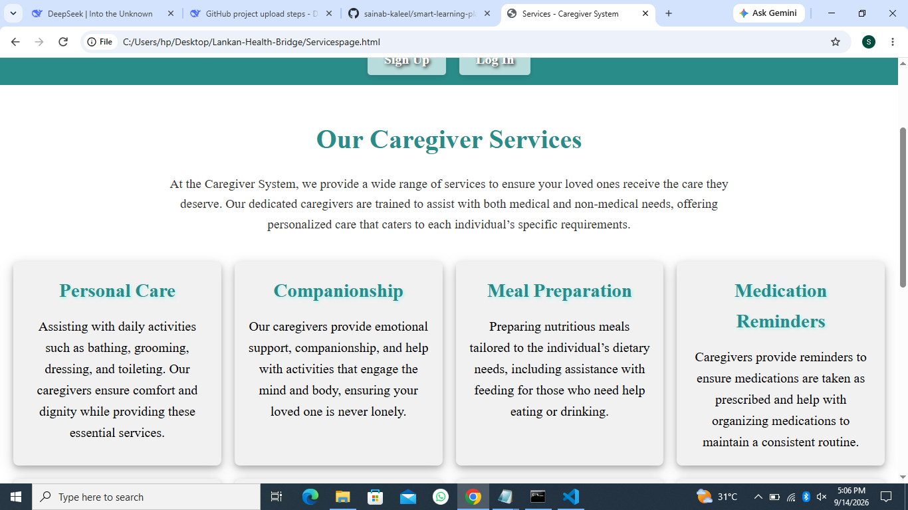
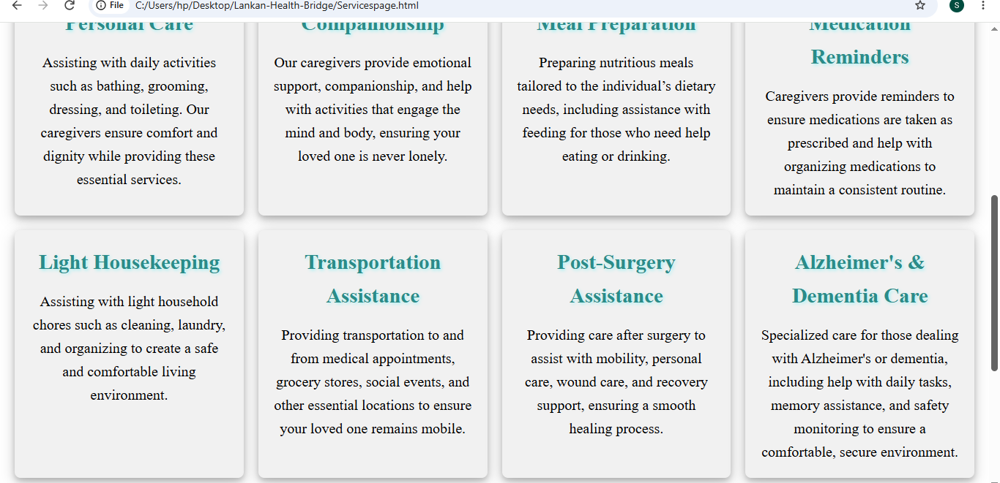

# 🏥 Lankan Health Bridge

A multi-page healthcare website designed to connect users with essential health services in Sri Lanka. Built with a clean, responsive interface using HTML and CSS.

---

## 📖 About the Project

**Lankan Health Bridge** is a front-end web project that provides an accessible platform for users to explore healthcare-related information and services. The site focuses on a clean UI, easy navigation, and a mobile-friendly design.

### Key Highlights

- 🎨 Modern, clean UI design
- 📱 Fully responsive layout
- 🧭 Multi-page navigation
- ♿ User-friendly interface
- ⚡ Lightweight and fast-loading

---

## 🛠️ Built With

- **HTML5** – Semantic structure
- **CSS3** – Styling and responsive design

---

## 📸 Screenshots

### 🏠 Home Page


### ℹ️ About Us Page


### 🩺 Services Page




### 📞 Contact Us Page


### 🔐 Login Page


### ✍️ Signup Page


---
## 📂 Project Structure

Lankan-Health-Bridge/
│
├── HTML Pages
│ ├── Homepage.html
│ ├── Aboutpage.html
│ ├── Contactpage.html
│ ├── Servicespage.html
│ ├── Loginpage.html
│ └── Signuppage.html
│
├── CSS Stylesheets
│ ├── Homepage.css
│ ├── Aboutpage.css
│ ├── Contactpage.css
│ ├── Servicespage.css
│ ├── Loginpage.css
│ └── SignUppage.css
│
├── Screenshots/
│ ├── home-1.png
│ ├── home-2.png
│ ├── home-3.png
│ ├── home-4.png
│ ├── home-5.png
│ ├── about-1.png
│ ├── about-2.png
│ ├── services-1.png
│ ├── services-2.png
│ ├── contact.png
│ ├── login.png
│ └── signup.png
│
├── images/ # Site images (logos, banners, etc.)
└── README.md
---

## 🚀 Getting Started

### Prerequisites

All you need is a modern web browser (Chrome, Firefox, Edge, Safari).

### How to Run Locally

1. **Clone the repository**

   ```bash
   git clone https://github.com/sainab-kaleel/lankan-health-bridge.git
Navigate into the folder

bash
cd lankan-health-bridge
Open the site

Double-click index.html, or

Right-click → Open with → your preferred browser

🎯 Features
✅ Multi-page navigation (Home, Login, Signup, Services)

✅ Clean and modern UI

✅ Responsive design for all screen sizes

✅ Organized CSS structure

🔮 Future Enhancements
□ Add JavaScript for interactive features
□ Backend integration with Node.js & Express
□ User authentication system
□ Appointment booking feature
□ Migrate to React.js (MERN stack)
👩‍💻 Author
Sainab Kaleel

🎓 Final Year HND IT Student

💼 Aspiring Software Engineer | MERN Stack Developer

🔗 GitHub: @sainab-kaleel

📄 License
This project is open-source and available for educational purposes.

⭐ Show Your Support
If you found this project helpful, please give it a ⭐ on GitHub!

